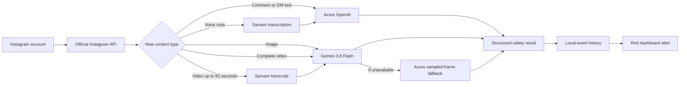

# Instagram Safety Monitor

A local, AI-assisted dashboard that reviews Instagram comments and media for potential cyberbullying.

The monitor combines Instagram ingestion with specialized models for text, vision, speech, and native
video understanding. Flagged activity is shown with an explicit red **Bullying detected** alert,
severity, confidence, and a short explanation.

> [!WARNING]
> Instagram access uses Meta's official Instagram API with Instagram Login. Use a Professional
> (Business or Creator) account and comply with Instagram's terms and all applicable privacy laws.

## Features

- Continuous polling for new comments and recent media
- Text moderation with Azure OpenAI
- Image content summaries and moderation with Vertex AI Gemini
- Voice-note and video-audio transcription with Sarvam AI Saaras v4
- Native video analysis with Vertex AI Gemini 3.8 Flash for videos up to 60 seconds
- Automatic Azure image/frame-analysis fallback when Gemini is unavailable
- Per-account session, seen-item, and event isolation
- Browser-based Instagram OAuth account connection
- Responsive, keyboard-accessible local dashboard with alert filters
- No cloud credentials committed to the repository

## How it works



| Content               | Primary analysis                        | Fallback                         |
| --------------------- | --------------------------------------- | -------------------------------- |
| Comments and text DMs | Azure OpenAI                            | Recorded as analysis unavailable |
| Images                | Vertex AI Gemini                        | Azure OpenAI vision              |
| Voice notes           | Sarvam transcript, then Azure OpenAI    | Recorded as analysis unavailable |
| Videos                | Gemini 3.8 Flash with Sarvam transcript | Azure OpenAI over sampled frames |

Every AI result is normalized to the same schema: bullying status, confidence, severity, reason, and
categories. The application reports potential harm; it does not delete, hide, reply to, or otherwise
moderate Instagram content automatically.

Images and videos also show a short content summary in the dashboard's **Media** filter. Vertex
uses a structured JSON response with a 1,600-token output allowance and one retry at 3,200 tokens
if the result is incomplete. Videos are limited to their first 60 seconds. Model confidence is not
a measured accuracy score. Unavailable analysis is shown explicitly and failed items are retried.

## Requirements

- Python 3.11 or newer
- FFmpeg available on `PATH`
- Azure CLI authenticated to an Azure OpenAI resource
- Google Cloud CLI authenticated to a billing-enabled project with Vertex AI enabled
- Sarvam AI API key
- Instagram account credentials

The dashboard is dependency-light: the web server uses Python's standard library and the monitor uses
the packages pinned in `requirements.txt`.

## Setup

### 1. Install the project on another Windows PC

Install Python 3.11+, Git, FFmpeg, Azure CLI, and Google Cloud CLI. Then clone the repository:

```powershell
git clone https://github.com/beyondmarks-ai/Cyberbullying.git
Set-Location Cyberbullying
```

FFmpeg must be available as `ffmpeg` in PowerShell. After installing it, verify with:

```powershell
ffmpeg -version
```

### 2. Create the Python environment

```powershell
py -m venv .venv
.\.venv\Scripts\python.exe -m pip install -r requirements.txt
```

### 3. Authenticate the cloud CLIs

```powershell
az login
gcloud auth login
gcloud config set project YOUR_GCP_PROJECT_ID
gcloud services enable aiplatform.googleapis.com
```

The Azure identity must be allowed to list keys for the configured Azure OpenAI resource. The Google
identity needs permission to call Vertex AI models in the selected project.

### 4. Configure the application

```powershell
Copy-Item .env.example .env
```

Edit `.env` and provide the following values:

| Variable                  | Required | Purpose                                                |
| ------------------------- | -------: | ------------------------------------------------------ |
| `IG_POLL_SECONDS`         |       No | Poll interval; defaults to `60`                        |
| `IG_APP_ID`               |      Yes | Instagram App ID from Business login settings          |
| `IG_APP_SECRET`           |      Yes | Instagram App Secret from Business login settings      |
| `IG_REDIRECT_URI`         |      Yes | OAuth callback URL registered in Meta                  |
| `AZURE_OPENAI_GROUP`      |      Yes | Azure resource group                                   |
| `AZURE_OPENAI_RESOURCE`   |      Yes | Azure OpenAI account name                              |
| `AZURE_OPENAI_ENDPOINT`   |      Yes | Azure OpenAI endpoint URL                              |
| `AZURE_OPENAI_DEPLOYMENT` |       No | Vision-capable deployment; defaults to `gpt-4o`        |
| `SARVAM_API_KEY`          |      Yes | Sarvam speech-to-text credential                       |
| `GOOGLE_CLOUD_PROJECT`    |       No | GCP project; falls back to the active `gcloud` project |
| `GOOGLE_CLOUD_LOCATION`   |       No | Vertex location; defaults to `global`                  |
| `GOOGLE_VIDEO_MODEL`      |       No | Video model; defaults to `gemini-3.8-flash`            |

Do not commit `.env`. It is intentionally ignored by Git.
The monitor uses values explicitly set in this project's `.env` ahead of inherited environment
variables. Variables omitted from `.env` still use the process environment.

### 5. Start the dashboard

```powershell
.\start-dashboard.cmd
```

Or run it directly:

```powershell
.\.venv\Scripts\python.exe dashboard.py
```

Open [http://127.0.0.1:8765](http://127.0.0.1:8765). Click **Connect Instagram** and approve access through Meta.

For local-only use, the dashboard works at this address without a tunnel. Instagram OAuth and
webhooks require a stable public HTTPS URL. A temporary Cloudflare quick tunnel is suitable for
testing, but its hostname changes when restarted; update `IG_REDIRECT_URI`, `IG_WEBHOOK_URL`, and
the matching Meta settings each time. For a reliable deployment, use a named Cloudflare tunnel or
host the dashboard behind a permanent HTTPS domain.

### Tester and public login access

The button opens Instagram's official authorization screen in a separate window and returns to the
dashboard automatically. Meta still controls which accounts may authorize the app:

- While the Meta app is in **Development** mode, only app-role users and Instagram testers who have
  accepted their invitation can connect.
- Testers must sign in to the same Instagram Professional (Business or Creator) account that was
  added in the Meta developer dashboard.
- To let non-testers connect, switch the Meta app to **Live** and obtain any required App Review /
  Advanced Access for `instagram_business_basic`, `instagram_business_manage_comments`, and
  `instagram_business_manage_messages`.

This local dashboard has one active account at a time. A public, multi-user deployment also requires
authenticated application users, encrypted per-user token storage, and per-user data isolation.

## Monitoring behavior

Each polling cycle checks:

- Up to 100 recent posts (paginated)
- Up to 100 comments per post, requested in pages of at most 50, plus replies

Previously observed item IDs are stored per account under `tools/accounts/`, preventing duplicate
alerts. Events are also isolated per account and the dashboard reads the latest 200 records.

Signed Instagram webhooks at `/webhooks/instagram` accept comments and incoming messages, including
image/audio/video attachments. Events are saved before acknowledgment, then processed by the monitor.
Configure the public HTTPS URL and verify token shown in the local dashboard in Meta, and subscribe
the account to comments/messages. Meta must permit event delivery for your app/account state.
A working local handler does not imply Meta has enabled delivery.

The dashboard is intended for local use. Cloudflare-forwarded requests may reach OAuth and webhook
routes only; event data and setup values are blocked on the public tunnel. The quick-tunnel URL changes
when restarted; update Meta and the local configuration together.

Videos are normalized locally to MP4, limited to 60 seconds, and sent inline to Vertex AI. Sarvam
receives mono 16 kHz audio in chunks of at most 25 seconds. Downloaded media and conversion files are
temporary and deleted after processing.

## Verification

Run the local checks before committing:

```powershell
.\.venv\Scripts\python.exe -m py_compile dashboard.py examples\comment_monitor.py examples\azure_moderation.py
.\.venv\Scripts\python.exe dashboard.py --self-test
.\.venv\Scripts\python.exe examples\comment_monitor.py --self-test
.\.venv\Scripts\python.exe examples\azure_moderation.py
npm run build
```

The self-tests do not call Instagram or paid AI APIs. End-to-end cloud checks require the configured
accounts and may incur usage charges.

## Security and privacy

- The HTTP server binds only to `127.0.0.1`; do not expose it directly to a public network.
- Instagram app secrets and Sarvam credentials stay in the ignored local `.env` file or environment.
- OAuth tokens are stored locally, with expiry tracking and refresh when nearing expiration.
- Azure credentials are obtained at runtime through Azure CLI; no Azure key is written by the app.
- Vertex credentials are obtained at runtime through Google Cloud CLI; no service-account key is added.
- Instagram content is transmitted to Azure OpenAI, Sarvam AI, and Google Vertex AI for analysis.
- Session files, event history, temporary media, virtual environments, and build output are ignored.

Review the providers' retention, regional processing, and data-governance terms before monitoring real
people or deploying beyond a controlled test environment.

## Troubleshooting

### Monitor stopped

If the dashboard works but reports **Monitor stopped**, the official token may be missing or expired.
Click **Connect Instagram** again and approve access.

### AI analysis unavailable

Confirm all three provider credentials are active:

```powershell
az account show
gcloud auth list --filter=status:ACTIVE
gcloud config get-value project
```

Also confirm `SARVAM_API_KEY` is set and `ffmpeg -version` succeeds.

## Project layout

```text
dashboard.py                    Local HTTP server and account switching
dashboard/index.html            Monitoring interface
examples/comment_monitor.py     Official Instagram polling and moderation pipeline
examples/instagram_graph.py     Official Instagram API client
examples/instagram_store.py     Atomic account storage and webhook normalization
tests/test_monitor.py           Offline ingestion regression checks
examples/azure_moderation.py    Azure, Sarvam, Gemini, and media processing
requirements.txt                Pinned Python dependencies
start-dashboard.cmd             Windows launcher
```

The active safety-monitor application is Python-based. The legacy TypeScript private-API source remains
in `src/` for compatibility but is not imported by the dashboard.

## License

MIT. See `LICENSE` for the complete terms and retained notices.

### Verification status and limits

Run `.\\.venv\\Scripts\\python.exe tests/test_monitor.py` for offline regression checks.
The dashboard reports last scan time and errors, rather than treating a live process as a successful scan.
Comments remain visible when analysis fails, labeled unknown; repeated attempts replace their display entry.
An empty Meta comments response is reported explicitly if the media reports a positive comment count.
Webhook delivery still requires configuration in Meta. No guarantee is made that App Review alone resolves an empty response.
