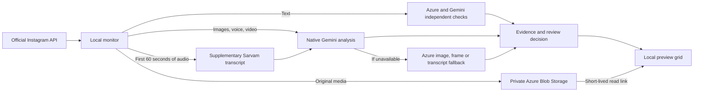

# Instagram Safety Monitor

A local dashboard for reviewing Instagram messages, comments, images, voice notes, and videos for potential cyberbullying—with original-content previews and evidence-based AI assessments.

Built with Python, Meta's official Instagram API, Azure OpenAI, Gemini, Sarvam, and private Azure Blob Storage. Cloud CLIs are **not required at runtime**; the application uses API keys.

> [!IMPORTANT]
> This is a screening and human-review tool, not a perfect detector or an autonomous moderation system. Models can miss abuse, misunderstand language, or flag innocent content. Review the evidence before taking action against anyone.

## Contents

- [What you get](#what-you-get)
- [Install on Windows](#install-on-windows)
- [Configuration reference](#configuration-reference)
- [Connect Instagram and webhooks](#connect-instagram-and-webhooks)
- [Set up private Azure previews](#set-up-private-azure-previews)
- [Update an existing installation](#update-an-existing-installation)
- [How analysis works](#how-analysis-works)
- [Data, privacy, and costs](#data-privacy-and-costs)
- [Troubleshooting](#troubleshooting)
- [Tests and verification](#tests-and-verification)
- [Project structure](#project-structure)

## What you get

- **Preview grid:** original text, click-to-enlarge images, video controls, and voice-note playback.
- **Sensitive screening:** prompts cover mild put-downs, exclusion, threats, mixed languages, transliteration, disguised words, emojis, visible text, and gestures.
- **Independent text checks:** Azure and Gemini assess text separately; disagreement goes to human review.
- **Native media analysis:** Gemini examines images, audio, and overlapping video segments. Sarvam supplies supplementary transcripts.
- **Explainable cards:** summaries, severity, model confidence, evidence, language labels, uncertainties, and segment results.
- **Private previews:** short-lived read-only links, seven-day expiry, Azure lifecycle cleanup, and manual deletion.
- **Official Instagram login:** account-scoped history, signed webhooks, polling, and token refresh support.
- **Chat history:** manually import available older conversations, filter by chat, and recover available previews without losing previous AI results.
- **Double-click Windows setup:** checks/installs Python, FFmpeg and Python packages, opens a local credential form, then starts the dashboard and matching Cloudflare tunnel.

| Card state | Meaning |
| --- | --- |
| Potential bullying | Evidence of possible abuse. Review it; this is not a definitive finding about a person. |
| Needs review | Meaning, context, coverage, or model agreement is uncertain. |
| No bullying detected | No abuse identified in the assessed content—not a guarantee that it is harmless. |
| Analysis unavailable | The content could not be assessed. It is not classified as safe. |
| Not analyzed | Imported history has no existing AI assessment. Importing it does not run AI or mark it safe. |

The app does **not** automatically delete Instagram messages, hide comments, reply, block users, or report accounts.

## Install on Windows

### Easiest way: download, extract, double-click

For **Windows 10/11, 64-bit** with an internet connection:

1. [Download the project ZIP](https://github.com/beyondmarks-ai/Cyberbullying/archive/refs/heads/main.zip). Right-click it, choose **Extract All**, and place the folder in Documents. Do not run the app from inside the ZIP.
2. Open the extracted folder and double-click **`start-dashboard.cmd`**. Keep the window open. Allow several minutes on first use. It checks Python, FFmpeg/FFprobe, and Python packages, installing missing tools using Windows Package Manager (`winget`). Git, Node, Azure CLI, and Google Cloud CLI are **not needed**.
3. On first use, fill in the **setup form** with credentials from your project administrator or the services listed below. Click **Save and continue**. Secrets are masked in the form and saved only in this PC's ignored `.env` file. The form does not create accounts or verify whether keys work.
4. The browser opens the dashboard. Expand **Admin setup for comments and messages** and copy its login redirect URL, webhook callback URL, and verify token into Meta as described in [Connect Instagram and webhooks](#connect-instagram-and-webhooks). Enable **messages** and **comments**.
5. Click **Connect Instagram**, approve access, then send a new DM from another account allowed by your Meta setup. A new card normally appears after the next monitor scan plus AI processing time. The default scan interval is 60 seconds; long videos can take longer.

**After setup:** double-click the same `start-dashboard.cmd` whenever you want to start. It reuses your credentials and checks dependencies. Leave its window open; press **Ctrl+C** there to stop the services it started.

> [!IMPORTANT]
> This is a one-click **software setup/launcher**, not zero-configuration cloud hosting. You still need authorized Instagram access, cloud resources/API keys, and Meta callback registration. Cloudflare's free temporary URL usually changes when its tunnel restarts, so **update both URLs in Meta whenever they change**. Updating `.env` alone does not update Meta. A stable HTTPS deployment/named tunnel is needed to avoid that recurring step.

### What you or your administrator must provide

| Requirement | Why it is needed |
| --- | --- |
| Instagram Professional account + Meta app | Official access to the account's messages/comments. Testers must have the required roles/invitations; public users require the relevant Meta approval/live setup. |
| Azure OpenAI endpoint, deployment, API key | Text checks and visual-analysis fallback. |
| Gemini or Vertex Express API key + model | Image, audio, video, and independent text analysis. |
| Sarvam API key (recommended) | Supplementary speech transcription. |
| Private Azure storage + key (for previews) | Save images/audio/video for seven days. The administrator must configure privacy and lifecycle cleanup; see the storage section. |

You cannot copy just the project to a different PC and expect cloud credentials, Instagram login, or local history to appear there. Ask your administrator to provide credentials **securely**; never upload `.env`, tokens, or chat history to GitHub. A Meta app's shared webhook configuration also means changing its callback to a second PC can stop deliveries to the first PC. Use one active receiver, or a properly designed shared deployment.

### If setup stops

- **App Installer/winget missing:** install or update [App Installer](https://apps.microsoft.com/detail/9nblggh4nns1) from Microsoft Store, then retry. Company-managed PCs may require IT approval. Manual installation is below.
- **Windows permission prompt:** review the publisher/package before approving. The script requests Python from `Python.Python.3.13` and media tools from `Gyan.FFmpeg`; their license/source agreements are accepted by the installer command. Do not disable Windows security to run an untrusted download.
- **Blocked by company policy:** ask IT to approve the local script. The launcher uses a process-only PowerShell execution-policy setting; it does not change your machine's persistent policy or bypass organizational enforcement.
- **Port 8765 already in use:** no installation/settings changes are made. Open the running dashboard at http://127.0.0.1:8765, or stop its launcher before updating/configuring.
- **Copied an old `.venv` from another PC:** virtual environments are not portable. Prefer a fresh extracted folder and securely transfer only your configuration; let setup build its own environment.
- **Network/install failed:** keep the error message, fix connectivity/permissions, and rerun the launcher. Do not post credentials or private logs publicly.

Optional commands from PowerShell inside the project folder:

```powershell
# Read-only prerequisite/configuration-field check (no installations or key validation)
.\start-dashboard.cmd -CheckOnly
# Reopen the local credential form, then launch (stop the existing launcher first)
.\start-dashboard.cmd -Configure
# Use an already running external/stable tunnel; do not create a temporary tunnel
.\start-dashboard.cmd -LocalOnly
```

`-LocalOnly` requires `IG_REDIRECT_URI` and `IG_WEBHOOK_URL` in `.env` to point to your existing HTTPS tunnel, already registered in Meta. It does not create/configure that tunnel.

<details>
<summary>Manual installation and credential sources (optional alternative)</summary>

### 1. Check prerequisites

Install Python **3.11–3.14** (3.13 recommended/tested), FFmpeg (including **FFprobe**), and a modern browser. Git is optional if you downloaded the ZIP. Both media tools must be on `PATH`:

```powershell
py --version
git --version
ffmpeg -version
ffprobe -version
```

Open a new PowerShell window after installing tools so it receives the updated `PATH`.

You also need:

- An Instagram **Professional account** (Business or Creator) and a Meta app configured for Instagram Login.
- An Azure OpenAI resource with a vision- and structured-output-capable deployment, endpoint, and API key.
- A Google AI Studio Gemini API key **or** a compatible Vertex AI Express Mode API key.
- A Sarvam API key for supplementary speech transcription.
- A private Azure storage account/container and key if you want saved media previews.

Azure CLI is useful for one-time provisioning. Google Cloud CLI is optional for credential administration. Neither is invoked by the running analysis pipeline. Node/npm is unnecessary for the Python dashboard.

### 2. Clone and install dependencies

```powershell
git clone https://github.com/beyondmarks-ai/Cyberbullying.git
Set-Location Cyberbullying
py -m venv .venv
.\.venv\Scripts\python.exe -m pip install -r requirements.txt
```

### 3. Configure credentials

For a **new installation**:

```powershell
if (-not (Test-Path .env)) { Copy-Item .env.example .env }
notepad .env
```

Fill in the values in [Configuration reference](#configuration-reference). Do not overwrite an existing `.env` during updates.

Where to obtain credentials:

- **Meta:** Instagram → API setup with Instagram login. Use the Instagram App ID and secret associated with that login setup.
- **Azure OpenAI:** the resource's **Keys and Endpoint** page. Use the actual deployment name, which can differ from the underlying model name.
- **Gemini:** [Google AI Studio API keys](https://aistudio.google.com/apikey), or a compatible Vertex AI Express Mode key.
- **Sarvam:** your Sarvam dashboard's API-key settings.
- **Preview storage:** the storage account's **Access keys** page. This is a different key from Azure OpenAI.

For Vertex, set `GEMINI_API_PROVIDER=vertex-express` and choose a model available through that API. Do not assume an AI Studio key, a Google project ID, and a Vertex key are interchangeable. Access, quotas, billing, and data-processing terms depend on the selected API.

### 4. Start the dashboard

```powershell
.\start-dashboard.cmd
```

Open **[http://127.0.0.1:8765](http://127.0.0.1:8765)** on the same PC.

The launcher finds Cloudflare Tunnel or downloads the official Windows executable after checking its published SHA-256 digest. It starts a tunnel, updates `IG_REDIRECT_URI` and `IG_WEBHOOK_URL` without replacing other settings, starts the dashboard, and verifies that the tunnel reaches this installation.

Keep the launcher window open. **Ctrl+C** stops the services it started. A busy port 8765 causes startup to stop without changing configuration.

> [!NOTE]
> The launcher updates local URLs, **not Meta's allowlist or webhook settings**. Complete the Instagram setup below before expecting login or incoming messages to work.

</details>

## Configuration reference

See [.env.example](.env.example) for the complete template.

| Variable | Purpose / default |
| --- | --- |
| `IG_APP_ID` | Instagram Login App ID. |
| `IG_APP_SECRET` | Instagram Login App Secret. Keep private. |
| `IG_REDIRECT_URI` | HTTPS URL ending in `/auth/instagram/callback`; updated by the tunnel launcher. |
| `IG_WEBHOOK_URL` | HTTPS URL ending in `/webhooks/instagram`; updated by the tunnel launcher. |
| `IG_POLL_SECONDS` | Poll interval; default `60`, minimum `30`. |
| `AZURE_OPENAI_KEY` | Azure OpenAI resource key. |
| `AZURE_OPENAI_ENDPOINT` | Matching endpoint, such as `https://YOUR-RESOURCE.openai.azure.com`. |
| `AZURE_OPENAI_DEPLOYMENT` | Vision/structured-output deployment name; default `gpt-4o`. |
| `GEMINI_API_PROVIDER` | `gemini` (default) or `vertex-express`. |
| `GEMINI_API_KEY` | Key authorized for the selected Google API. |
| `GEMINI_MODEL` | Available model ID; default `gemini-2.5-flash`. |
| `SARVAM_API_KEY` | Supplementary speech-to-text key. Native audio analysis can continue if transcription fails. |
| `MODERATION_TEXT_SECOND_OPINION` | Default `true`; set `false` for Azure-only text checks at lower cost. |
| `MODERATION_MAX_MEDIA_SECONDS` | Default `600` seconds per attachment; clamped to `60–1800`. |
| `AZURE_STORAGE_ACCOUNT` | Storage account name; needed for saved previews. |
| `AZURE_STORAGE_CONTAINER` | Private preview container; default `instagram-previews`. |
| `AZURE_STORAGE_KEY` | Storage account key; needed for saved previews. |

The monitor loads explicit values from the project's `.env` ahead of inherited environment variables. The dashboard/launcher settings reader checks the process environment first, so remove conflicting inherited values when troubleshooting. Restart after changing settings.

Storage is optional: analysis can run without it, but media previews will not be saved. The template does not create resources or obtain keys automatically. Organizations that disable API keys need a different authentication integration.

## Connect Instagram and webhooks

### Register the current URLs in Meta

Expand **Admin setup for comments and messages** in the dashboard. Copy these values exactly:

| Dashboard value | Destination in Meta |
| --- | --- |
| Login redirect URL | Instagram → API setup with Instagram login → Business login settings → allowed redirect URLs. |
| Callback URL | Instagram webhook configuration → Callback URL. |
| Verify token | The webhook configuration's Verify token field. |

Save the allowed redirect URL. Verify/save the webhook callback and enable the `comments` and `messages` subscriptions required by your setup. Meta's exact labels can vary.

The verify token is derived from the app secret. **Changing only the tunnel URL does not change the verify token.** Copy the displayed token; do not paste the app secret into that field.

Click **Connect Instagram** on the **local dashboard**, sign in to the intended professional account, and approve access. The dashboard should show **Signed in as @…**.

### Tester and public access

In Meta Development mode, eligible app-role/tester accounts must accept their invitations and use the matching professional account. Adding a tester does not make the application available to every Instagram user.

Public use requires Meta's applicable Live-mode, App Review, and Advanced Access requirements for:

- `instagram_business_basic`
- `instagram_business_manage_comments`
- `instagram_business_manage_messages`

The app tracks token expiry and refreshes eligible long-lived tokens near expiry. A temporary token is not a permanent connection; reconnect if authorization expires or is revoked.

### Tunnels and another PC

A quick tunnel gets a temporary hostname. Each new hostname must be registered in Meta. Never reuse an old PC's tunnel URL for a different local server: the OAuth ticket belongs to the process that created it.

If you already manage a permanent tunnel and have registered its URLs:

```powershell
.\start-dashboard.cmd --local-only
```

This preserves configured URLs and does not start a tunnel. To start only the Python server:

```powershell
.\.venv\Scripts\python.exe dashboard.py --no-browser
```

Changing Meta's webhook callback moves delivery to the new receiver; it does not duplicate messages across two PCs. Cloudflare's public URL is for callbacks/webhooks, **not remote dashboard access**.

## Set up private Azure previews

### One-time cloud setup

Use a **dedicated** preview storage account so lifecycle/deletion settings cannot affect unrelated files:

1. Create a **StorageV2 / Standard LRS** account in your chosen Azure region.
2. Require HTTPS and TLS 1.2 or later. Disable public/anonymous blob access.
3. Create a **private** container named `instagram-previews`.
4. Apply [tools/preview-lifecycle.json](tools/preview-lifecycle.json) to this dedicated account.
5. Put its account name, container name, and storage key in `.env`.

Azure CLI can create the account; replace the example names before running:

```powershell
az login
az storage account create --name YOUR_UNIQUE_PREVIEW_ACCOUNT --resource-group YOUR_RESOURCE_GROUP --location centralindia --sku Standard_LRS --kind StorageV2 --https-only true --min-tls-version TLS1_2 --allow-blob-public-access false --allow-shared-key-access true
```

The account name must be globally unique, 3–24 lowercase letters/digits. Create the private container in the portal, then apply the policy:

```powershell
az storage account management-policy create --account-name YOUR_UNIQUE_PREVIEW_ACCOUNT --resource-group YOUR_RESOURCE_GROUP --policy tools/preview-lifecycle.json
```

This command sets the account's management policy: **do not apply it blindly to a shared account with existing rules**. If you rename the container, update the policy's `prefixMatch` too. Review snapshots, versioning, soft-delete, and immutability settings; these can retain copies or prevent deletion. They are not enabled as part of this application's dedicated-account setup.

### Preview behavior and retention

- Attachments are uploaded before analysis, so a classifier failure does not discard a successfully saved preview.
- Images open larger on click; audio/video use browser controls. Unsupported browser codecs may not play.
- Links grant **read-only access to one blob**, over HTTPS, for **at most five minutes**. Use **Reload preview** if a link expires.
- The application stops issuing access **seven days after initial capture**. Retries do not extend expiry.
- Azure lifecycle deletion is asynchronous; physical deletion is **not guaranteed at the exact expiry second**.
- **Delete preview** removes the cloud media, not the Instagram message, original text, analysis, or event record.
- Deletion is not recoverable through this dashboard. Already downloaded/browser-held copies cannot be revoked.
- Use **Sync chat history** to recover available older chat attachments and previews on existing post cards. Expired Instagram source links cannot be reconstructed; deleted/expired saved previews are not re-uploaded by sync.

Unchanged polling does not rebuild cards. New cards wait while audio/video is actively playing, so playback is not interrupted.

### Import older chats and previews

1. Open `http://127.0.0.1:8765` on the PC running the dashboard and connect Instagram.
2. Click **Sync chat history** above the activity grid. Progress shows imported messages, conversations, available previews, and unavailable attachments.
3. Select a conversation to see its messages with original timestamps, sender names, and sent/received labels. **Messages** includes images, videos, and voice notes sent in chats.

Each manual sync fetches up to **20 conversations, 50 recent messages per conversation, and 200 messages total** through Instagram's API. It can only import content Meta makes available under the connected account's permissions—not a full Instagram inbox export. Repeated syncs update the same message IDs rather than duplicating cards. The newest 500 combined live/imported records are displayed.

Available attachments are copied to private Azure storage with the existing size/type limits and seven-day retention from initial capture. Existing post cards can also recover media from up to 100 recent posts. Source URLs and signed playback links are not persisted in the history file. Cards explain unavailable attachments; a sync cannot recover deleted Instagram content or files Meta no longer serves.

Existing AI assessments are preserved. Other imported messages show **Not analyzed**: history sync makes no AI calls and does not silently mark them safe. Live monitoring continues separately. Imported text/metadata is stored per account on this PC; preview deletion/expiry does not delete that history. The sync endpoint is local-only and allows one active import per account. If interrupted, restart sync; completed imports and captured previews are retained.

## Update an existing installation

**No need to clone again if you installed with Git.** Stop the running launcher with Ctrl+C, then run in the existing repository:

```powershell
git pull --ff-only
.\start-dashboard.cmd
```

If Git reports conflicting local changes, preserve/reconcile them before updating; do not reset or overwrite them blindly.

The launcher installs changed Python requirements and opens the form if required settings are missing. It does **not** silently download new project code. If you installed from ZIP, download the new ZIP into a **new folder**, stop the old app, and securely copy your `.env` into the new folder before launching. To retain local history and preview deletion records, also transfer `tools/accounts` privately; do not share that folder. Do not copy `.venv`. Keep the old folder as a backup until the new installation works.

When migrating from the earlier CLI-based version:

- Add `AZURE_OPENAI_KEY`, `GEMINI_API_KEY`, `GEMINI_API_PROVIDER`, and `GEMINI_MODEL`.
- Keep Instagram settings, the matching Azure endpoint/deployment, and the Sarvam key.
- Add the three `AZURE_STORAGE_*` settings for previews.
- `AZURE_OPENAI_GROUP`, `AZURE_OPENAI_RESOURCE`, `GOOGLE_CLOUD_PROJECT`, `GOOGLE_CLOUD_LOCATION`, and `GOOGLE_VIDEO_MODEL` are no longer used by the Python monitor.
- Re-register any new tunnel URLs in Meta. Cloud CLI logins do not transfer to another PC—and are no longer needed at runtime.

On a **different PC**, follow the fresh-install steps and transfer credentials securely. Git does not contain `.env`, Instagram tokens, event history, or the preview index. Using the same Azure account does **not** synchronize dashboard history or authentication. Keep the original preview index if preserving deletion history; a fresh index can allow an item to be captured again.

## How analysis works



| Input | Processing and limits |
| --- | --- |
| Text/comments | Independent Azure and Gemini checks by default. Disagreement or an incomplete second opinion goes to review. |
| Images | All images processed in batches of up to six, prepared at up to 2048px. Azure vision is the fallback. |
| Voice | Native Gemini audio; a Sarvam transcript is supplementary, not mandatory. |
| Video | Overlapping 60-second segments with two seconds of overlap; up to ten minutes per attachment by default. |
| Supplementary transcript | First 60 seconds, split into chunks of up to 25 seconds for Sarvam. |
| Oversized/partial media | Downloads limited to 50 MB per attachment. Unassessed portions and failed segments are surfaced. |
| Animated images | May have a preview, but are not silently classified using only their first frame; supply as video for timed analysis. |

Azure uses strict structured outputs. Gemini uses a response schema and retries an incomplete result once with a larger output budget. Technical failures remain eligible for retry; completed history is **not automatically re-scored** after a code/model change.

The monitor polls up to 100 recent posts and up to 100 comments per post plus replies. Incoming DMs/comments can arrive through signed webhooks. Echo/outgoing DM webhook events are skipped by live monitoring; manual history sync includes sent messages when Instagram provides them. The dashboard merges imported history with live events by message ID, preserving newer live assessments; it is not a full chat-history client.

### Accuracy limitations

No model can guarantee detection of every mild insult, language, dialect, gesture, sign language, or emoji meaning. Full conversation history is not supplied. Blur, small text, compression, brief video moments, sarcasm, cultural context, and quoted speech can cause mistakes. A single abusive act may be flagged; repetition is not required.

Sensitive screening routes uncertain cases to review rather than silently treating them as safe. This can increase false alarms and review workload. Model confidence is **not** a measured probability or accuracy score. Only content actually made available by Instagram can be assessed.

## Data, privacy, and costs

| Data | Location / handling |
| --- | --- |
| Credentials | Ignored local `.env` or process environment. Never commit or share in chat. |
| Instagram tokens | Local `tools/accounts/` with expiry metadata. Treat as secrets. |
| Text, analysis, event history | Account-scoped local files; not removed by preview expiry/deletion. |
| Preview ownership, expiry, deletion tombstones | Local `tools/accounts/previews.sqlite3`; metadata only, not media bytes. |
| Saved preview media | Private Azure Blob Storage with the retention policy described above. |
| Conversion files | Temporary local files removed after normal processing. |
| Launcher logs/downloads | Ignored `.runtime/`; logs can contain private content or diagnostics. |

Preview API routes reject tunnel/cross-site access and check the current account's ownership. SAS links are never persisted in event logs; anyone holding an unexpired link can read that one blob. The storage account key has broader powers and must remain private.

The dashboard binds to `127.0.0.1` and has **one active account at a time**. It is for a trusted local user, not a public multi-tenant service. Public deployment requires application authentication, stronger per-user authorization, encrypted secret storage, and a deployment/security review. A named tunnel does not add these protections.

Instagram content is sent to the configured AI providers and, when enabled, Azure storage. Review provider retention, regional processing, consent, and data-governance requirements before monitoring real people.

**Costs:** AI requests, transcription, blob storage, and downloads may incur charges. More images, longer clips, and independent text checks increase usage. Failed items can retry each polling cycle; stop the monitor during a prolonged outage to avoid repeatedly paying for successful portions.

## Troubleshooting

| Symptom | What to check |
| --- | --- |
| `Start Instagram login from the local dashboard` | Open `http://127.0.0.1:8765` on the server PC. Ensure the tunnel reaches this same process; do not reuse another PC's URL. |
| `Invalid redirect_uri` | Meta's registered URL must exactly match the current HTTPS login redirect URL, including its path. |
| Tunnel DNS/site unreachable | The old quick tunnel may have stopped. Start the launcher and register the new URLs in Meta. |
| Port 8765 already in use | Stop the existing dashboard/launcher first; do not start a second copy. |
| Connected, but no DMs/comments | Check webhook verification, subscriptions, permissions, accepted tester roles, and sender eligibility. Local connectivity does not prove Meta is delivering events. |
| `Monitor stopped` | Read logs for the actual startup failure. Reconnect if Instagram authorization expired/revoked; check dependencies/configuration too. |
| AI analysis unavailable | Check matching keys/endpoints/models and FFmpeg/FFprobe. The combined warning does not mean every provider failed. |
| Provider HTTP 401/403 | Check key validity, permissions, API restrictions, and whether the key matches the service. |
| Provider HTTP 404 | Check the Azure deployment name or Google model availability. |
| Provider HTTP 429 | Check quota/rate limits/billing; pause repeated scans while resolving it. |
| `No module named azure` | Install updated `requirements.txt` using this project's `.venv` Python. |
| No preview on an old card | Click **Sync chat history**. Only attachments still provided by Instagram can be recovered; check the card's unavailable/expired explanation. |
| Preview unavailable | Check storage settings, private container existence, key access, and media format/size. |
| Preview expired | Seven-day retention may have elapsed. For a five-minute playback-link expiry, try **Reload preview**. |
| Deletion pending | Retry **Delete preview**; the local record is protected against re-upload while deletion is pending. |
| New cards wait during playback | Pause/end the media; refresh intentionally avoids interrupting playback. |

For launcher-started sessions:

```powershell
Get-Content .runtime\dashboard.log -Tail 80
Get-Content .runtime\tunnel.log -Tail 40
```

A directly started dashboard logs to its terminal unless redirected. Redact credentials, signed URLs, and private content before sharing logs. Restart after editing `.env`; do not post the entire file for troubleshooting.

## Tests and verification

### Offline checks

These do not call Instagram or paid AI/storage APIs:

```powershell
.\.venv\Scripts\python.exe -m unittest discover -s tests
.\.venv\Scripts\python.exe -m py_compile dashboard.py examples\comment_monitor.py examples\azure_moderation.py examples\preview_storage.py
.\.venv\Scripts\python.exe examples\azure_moderation.py
```

The final command checks local conversion and requires FFmpeg. Optional DOM-level tests require Node:

```powershell
node tests/test_dashboard_ui.cjs
```

These interface tests check rendering logic, not a full browser/device playback matrix.

### Opt-in live checks

These use configured credentials and make **billable requests**:

```powershell
.\.venv\Scripts\python.exe tests\eval_sensitive.py --live --media
.\.venv\Scripts\python.exe tests\eval_preview_storage.py --live
```

- The analysis evaluation uses synthetic text/images. On Windows, `--media` adds locally synthesized English speech and a video with abuse after 60 seconds. Omit `--media` where Windows speech synthesis is unavailable.
- The storage evaluation creates/deletes three small synthetic blobs and checks blocked anonymous access, signed range reads, account isolation, deletion, and retries.
- Neither script adds events to the Instagram feed. Local temporary test files are cleaned up.

### Verification snapshot — 2026-10-02

- **72 Python tests passed** on Windows, covering ingestion, OAuth, launcher behavior, moderation, preview storage, ownership, expiry, deletion, history pagination, deduplication, local-only sync access, configuration validation, and installer sequencing.
- DOM checks passed for review states, original text, preview elements, stable polling, deletion, conversation filtering, unassessed imported messages, and sync progress.
- Live Azure checks passed for image/video/audio uploads, blocked public access, signed range reads, and deletion. Running-dashboard preview GET/DELETE routes were exercised with synthetic data.
- Live history sync imported 11 messages from two conversations and restored four image previews; signed reads succeeded. A subsequent real incoming DM reached the webhook and completed analysis.
- Windows `-CheckOnly` passed on the development PC. Missing-tool/first-install paths were tested with mocks; a clean second-PC installation and GUI interaction have not yet been verified end-to-end. The installer cannot guarantee availability of external package sources, keys, models, or Meta permissions.
- Live analysis matched **15 of 16 expected smoke-test outcomes**. A victim reporting an insult went to review because the models disagreed, instead of achieving the expected clear result. Earlier runs also varied on sarcasm and a neutral image.

These are functional checks, **not representative accuracy or a guarantee of perfect detection**. Production evaluation needs a consented, labeled dataset across the intended languages/modalities, human reviewers, and separate false-negative/false-positive measurements.

## Project structure

```text
dashboard.py                    Local HTTP server, OAuth, webhooks, preview access
start-dashboard.cmd             Double-click Windows entry point
tools/setup_windows.ps1         Prerequisite installation/checks and startup
tools/setup_config.py           Local first-run credential form
dashboard/index.html            Preview grid and review interface
examples/comment_monitor.py     Ingestion, analysis orchestration, preview capture
examples/azure_moderation.py    Azure/Gemini/Sarvam clients and media preparation
examples/preview_storage.py     Private Azure blobs and local preview metadata
examples/history_sync.py        Manual chat import and available-preview backfill
examples/instagram_graph.py     Official Instagram API client
examples/instagram_store.py     Account storage and webhook normalization
tools/launch_dashboard.py       Per-PC dashboard/tunnel startup
tools/preview-lifecycle.json    Seven-day Azure preview cleanup policy
tests/                         Offline tests and opt-in live evaluations
.env.example                   Credential-free configuration template
requirements.txt               Pinned direct Python dependencies
start-dashboard.cmd            Windows entry point
```

The active application is Python-based. Legacy TypeScript private-API sources remain in `src/` but are not imported by the dashboard. For those separate sources only, use `npm ci` and `npm run build`.

## License

[MIT](LICENSE). Existing copyright and attribution notices are retained.
